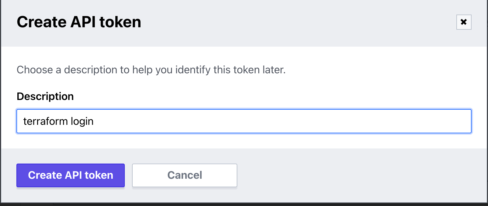

# TFE CLI-driven Run

## Expected Outcome

In this lab, we will invoke a Terraform run on TFE via your local Terraform client (Terraform OSS binary). This is also referred to as the _CLI-driven run_.

## Prerequisites

For this lab, we'll assume that you have [signed up](https://app.terraform.io/signup/account) for a Terraform Cloud account.

## How To

1. Login to TFE and click the "+ New Workspace" button.
2. In the **Connect to VCS** section, click the "CLI-driven Workflow" button.

3. Enter the name `tfecli-test-run` for the Workspace.
4. Create a new directory locally on your workstation named `tfecli-test-run` and create a `main.tf` within it that will provision something from Terraform.

**main.tf**
```
resource "random_shuffle" "character" {
  input = [
    "Walter White",
    "Skyler White",
    "Jesse Pinkman",
    "Marie Schrader",
    "Hank Schrader",
    "Saul Goodman",
  ]
  result_count = 1
}

output "favorite_character" {
  value = random_shuffle.character.result
}
```

5. Ensure you are properly authenticated into Terraform Cloud by running `terraform login` on the command line.

```bash
terraform login

Terraform will request an API token for app.terraform.io using your browser.

If login is successful, Terraform will store the token in plain text in
the following file for use by subsequent commands:
    /home/nyl/.terraform.d/credentials.tfrc.json

Do you want to proceed?
  Only 'yes' will be accepted to confirm.

  Enter a value: yes


---------------------------------------------------------------------------------

Open the following URL to access the tokens page for app.terraform.io:
    https://app.terraform.io/app/settings/tokens?source=terraform-login


---------------------------------------------------------------------------------

Generate a token using your browser, and copy-paste it into this prompt.

Terraform will store the token in plain text in the following file
for use by subsequent commands:
    /home/nyl/.terraform.d/credentials.tfrc.json

Token for app.terraform.io:
  Enter a value: 


Retrieved token for user gabe_maentz


---------------------------------------------------------------------------------

Success! Terraform has obtained and saved an API token.

The new API token will be used for any future Terraform command that must make
authenticated requests to app.terraform.io.

```



6. Within the same local working directory, create a `backend.tf` file to tell your local Terraform client how to reach your TFE instance:

**backend.tf**
```
terraform {
  backend "remote" {
    hostname     = "<TFE_HOSTNAME>"
    organization = "<TFE_ORGANIZATION_NAME>"
    token        = "<TFE_TOKEN>"

    workspaces {
      name = "tfecli-test-run"
    }
  }
}
```

- `TFE_HOSTNAME` is the hostname of your TFE
- `TFE_ORGANIZATION_NAME` is your specific TFE Organization name
- `TFE_TOKEN` a user API token retrieved from TFE

> Note: Be sure the workspace name matches what you created above.

7. `terraform init`
8. `terraform plan`

This will generate a `speculative plan` which can be viewed either on the CLI or within the TFE web interface by clicking on the link shown.

```bash
Running plan in the remote backend. Output will stream here. Pressing Ctrl-C
will stop streaming the logs, but will not stop the plan running remotely.

Preparing the remote plan...

To view this run in a browser, visit:
https://app.terraform.io/app/Enterprise-Cloud/tfecli-test-run/runs/run-YfhCry5S9C7mVcNk
```


9.  `terraform apply` - refresh the TFE UI and look for the running apply within your TFE Workspace

Notice that you can approve the apply either from within the web interface or via the command line.

## Summary

Step 6 is the key concept with the _CLI-driven run_ method. We need a `backend.tf` file so the local Terraform client knows where to make its API calls against TFE, and we also need a TFE API token so we can properly authenticate to our TFE instance.  

It is also important to note that we _did not_ connect our Workspace to a VCS repo.  This is because the Terraform client takes care of compressing and sending the code to the TFE workspace via the TFE API.

This method can be run locally as we just demonstrated, or it can be executed from a build script/ CI pipeline.

### Extra Credit

1. Play with the `terraform taint` command to get a new favorite character to display at random.
2. Update the count variable locally and re run a plan and apply.
3. View the state file in the TFE Run.
4. How does the CLI Driven workflow compare to the API Driven workflow?

## Resources

[TFE CLI-driven Run Workflow](https://www.terraform.io/docs/cloud/run/cli.html)
[TFE API-driven Run Workflow](https://www.terraform.io/docs/cloud/run/api.html)