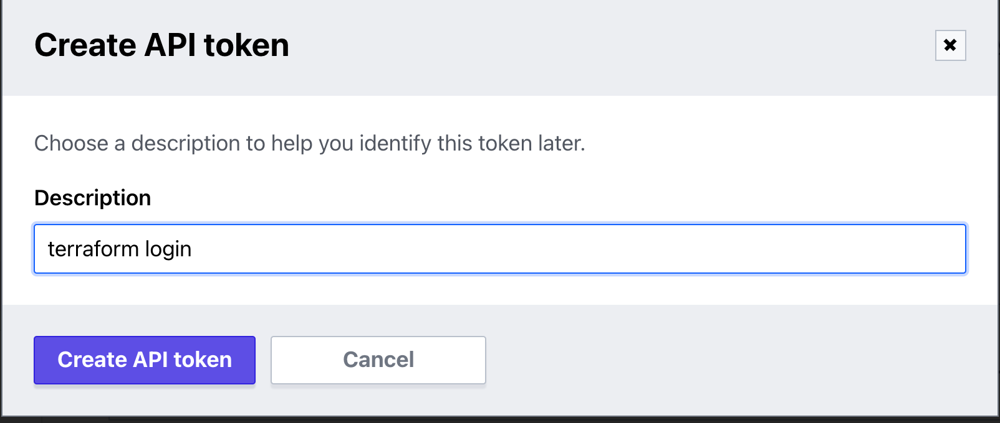
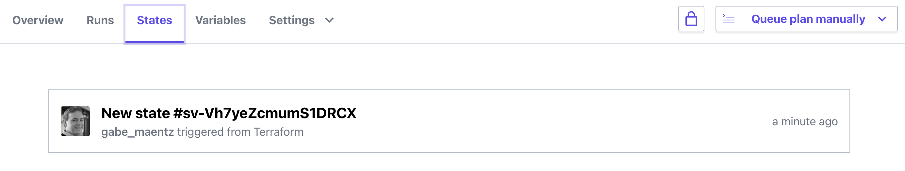

# Lab: Migrate State to Terraform Cloud/Enterprise

Duration: 20 minutes

This lab demonstrates how to migrate state to Terraform Enterprise.

- Task 1: Create a Terraform Cloud user token
- Task 2: Create a configuration which stores its state on Terraform Cloud
- Task 3: Create another Terraform config that reads from the state on Terraform Cloud

## Prerequisites

For this lab, we'll assume that you've installed [Terraform](https://www.terraform.io/downloads.html) and that you have [signed up](https://app.terraform.io/signup/account) for a Terraform Cloud account.

## Task 1: Create a Terraform Cloud user token

In order to store state remotely on Terraform Enterprise, we need to create a user token and configure our local environment to utilize that token.  Skip this step if you have already peformed this task in a previous lab.

### Step 1.1.1:

**Note:** You can skip this step if you've already created a organization.

[Log in](https://app.terraform.io) to Terraform Cloud and go to the new organization page:

* New users are automatically taken to the new organization page.
* If your user account is already a member of an organization, open the organization switcher menu in the top navigation bar and click the "Create new organization" button.

Enter a unique organization name and an email address for notifications, then click the "Create organization" button.


### Step 1.1.2:

Terraform's CLI needs credentials before it can access Terraform Cloud. We will leverage the `terraform login` command to perform our login to TFC.

```bash
terraform login

Terraform will request an API token for app.terraform.io using your browser.

If login is successful, Terraform will store the token in plain text in
the following file for use by subsequent commands:
    /home/nyl/.terraform.d/credentials.tfrc.json

Do you want to proceed?
  Only 'yes' will be accepted to confirm.

  Enter a value: yes


---------------------------------------------------------------------------------

Open the following URL to access the tokens page for app.terraform.io:
    https://app.terraform.io/app/settings/tokens?source=terraform-login


---------------------------------------------------------------------------------

Generate a token using your browser, and copy-paste it into this prompt.

Terraform will store the token in plain text in the following file
for use by subsequent commands:
    /home/nyl/.terraform.d/credentials.tfrc.json

Token for app.terraform.io:
  Enter a value: 


Retrieved token for user gabe_maentz


---------------------------------------------------------------------------------

Success! Terraform has obtained and saved an API token.

The new API token will be used for any future Terraform command that must make
authenticated requests to app.terraform.io.

```



## Task 2: Migrate a local state file to Terraform Cloud

For this task, you'll migrate the existing state from a local Terraform project to Terraform Cloud.

### Step 1.2.1
Create a new workspace in Terraform Cloud that is CLI-Driven called `server-build`.  Setup the configuration to utilize the `remote` backend, replacing `ORGANIZATION NAME` with the name of your organization in a `backend.tf` file.

```hcl
terraform {
  backend "remote" {
    hostname = "app.terraform.io"
    organization = "<ORGANIZATION NAME>"

    workspaces {
      name = "server-build"
    }
  }
}
```

### Step 1.2.2

Next reinitialize your terraform project locally and Terraform will detect that it needs to copy the local state file to TFC.

```bash
terraform init
Initializing modules...

Initializing the backend...
Do you want to copy existing state to the new backend?
  Pre-existing state was found while migrating the previous "local" backend to the
  newly configured "remote" backend. No existing state was found in the newly
  configured "remote" backend. Do you want to copy this state to the new "remote"
  backend? Enter "yes" to copy and "no" to start with an empty state.

  Enter a value: yes


Successfully configured the backend "remote"! Terraform will automatically
use this backend unless the backend configuration changes.

Initializing provider plugins...
- Reusing previous version of hashicorp/aws from the dependency lock file
- Reusing previous version of hashicorp/local from the dependency lock file
- Reusing previous version of hashicorp/null from the dependency lock file
- Reusing previous version of hashicorp/tls from the dependency lock file
- Using previously-installed hashicorp/aws v3.31.0
- Using previously-installed hashicorp/local v2.1.0
- Using previously-installed hashicorp/null v3.1.0
- Using previously-installed hashicorp/tls v3.1.0

Terraform has been successfully initialized!

You may now begin working with Terraform. Try running "terraform plan" to see
any changes that are required for your infrastructure. All Terraform commands
should now work.

If you ever set or change modules or backend configuration for Terraform,
rerun this command to reinitialize your working directory. If you forget, other
commands will detect it and remind you to do so if necessary.
```

### Step 1.2.3
Connect to your workspace inside TFE and browse to the State tab.  You should see that your state file has succesfully been migrated.



### Step 1.2.4

After validating the migration run a `terraform plan` and you should notice that Terraform does not by default remove the local state file that was migrated.  This is to ensure that you are comfortable with the migration and if you are will need to remove the local *.tfstate file manually.

```bash
Running plan in the remote backend. Output will stream here. Pressing Ctrl-C
will stop streaming the logs, but will not stop the plan running remotely.

Preparing the remote plan...

To view this run in a browser, visit:
https://app.terraform.io/app/Enterprise-Cloud/server-build/runs/run-iFXAhxKR7ketE85H

Waiting for the plan to start...

Terraform v0.14.8

------------ Terraform Cloud System Message ------------

Terraform Cloud detected a terraform.tfstate file in your working
directory: ./terraform.tfstate

The presence of this file causes a state migration error which prevents
Terraform from running successfully. To fix this error please migrate
your local terraform.tfstate to Terraform Cloud and make sure the
the file is deleted.

For step by step instructions on how to migrate your terraform.tfstate
file from Terraform Open Source to Terraform Cloud, please see:

   https://www.terraform.io/docs/enterprise/migrate/index.html

--------------------------------------------------------

Setup failed: Terraform Cloud detected a terraform.tfstate file
```

```bash
rm terraform.tfstate*
```

Once deleted you can confirm via a `terraform plan` and `terraform apply` that there are no changes to the infrastructure as a result of the migration. 

```bash
No changes. Infrastructure is up-to-date.

This means that Terraform did not detect any differences between your
configuration and real physical resources that exist. As a result, no
actions need to be performed.
```

### Step 1.2.5

Congratulations! You're now storing state remotely. With Terraform Cloud you are able to share your workspace with teammates. Back in the Terraform Cloud UI you'll be able to:

* View all your organization's workspaces
* Lock a workspace, making it easy to avoid conflicting changes and state corruption
* View state history